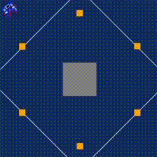

# RT1, Assignment 1
First assignment of Research Track 1 course at UniGe Robotics Engineering.

## Introduction
This python script makes an automated robot in a simulated environment move with the goal to bring all the boxes called `token` in an arena. The robot grabs them, transports them to the center of the arena and releases them. The process continues until all tokens have not been moved into the arena.


### Installing and Running

1. Clone the repository to your local machine (or download):
```bash
git clone https://github.com/NicolasBravi01/RT1_Unige.git
```

2. Execute the program with:
```bash
$ cd robot
$ python2 run.py assignment.py
```


## FlowChart


## Function Descriptions

Detailed descriptions of the functions within the robot control script are as follows:

### `drive(speed, seconds)`
Controls the robot's forward and backward movements by setting a consistent speed for both motors.

- **Parameters**:
  - `speed` (int): The power level sent to the motors to determine the robot's speed. Positive values move the robot forward, negative values move it backward.
  - `seconds` (int): The time in seconds for which the robot continues moving at the set speed.

 
### `turn(speed, seconds)`
Controls the robot's right and left rotations by running motors in opposite directions.

- **Parameters**:
  - `speed` (int): The power level for the rotation. Positive values turn the robot to the right, and negative values to the left.
  - `seconds` (int): The duration of the turn.


### `find_token(idMarkers)`
Identifies the closest token that is not included in the passed list of IDs, ignoring already those tokens.

- **Parameters**:
  - `idMarkers` (list of int): list of code of tokens to not consider.
- **Returns**: 
  - code (int): code of the closest token (-1 if no token out of list is detected)
  - dist (float): distance of the closest token (-1 if no token out of list is detected)
  - rot_y (float): angle between the robot and the token (-1 if no token out of list is detected)
  

### `isThereToken(idMarkers)`
It checks if there is any token in the robot's field of vision that is not in a specific list.

- **Parameters**:
  - `idMarkers` (list of int): list of code of tokens to not consider.
- **Returns**: A boolean value, `True` if there are tokens to be processed, `False` otherwise.

### `lookForToken(idMarkers)`
Executes a 360-degree rotational search for any token not in the specified list if none are initially visible.

- **Parameters**:
  - `idMarkers` (list of int): IDs of markers to ignore.
- **Returns**: `True` if a token is eventually found before or during the rotation, `False` if no new tokens are detected after a complete 360-degree turn.

### `seeCenterArena()`
Calculates how the robot should move relative to the Arena's center by determining the distance and angle from the robot's current position. 

- **Behavior**: We know that the cordinates of the center of Arena are (0,0). This function calculates the Euclidean distance between the origin (0,0) and a the robot's current cordinates. Subsequently, it calculates the angle to the center by determining the arctangent of the y-coordinate over the x-coordinate, then it normalize the angle.


- **Returns**:
  - dist (float): distance to the center of Arena
  - rot_y (float): angle between the robot and the the center of Arena

### `driveToArena()`
Navigates the robot towards the center of the Arena, continuously adjusting its path until it is within a defined proximity threshold.


### `driveTo(dist, angle)`
Directs the robot to a specific point by controlling the linear and angular movements to meet the target distance and orientation, moving just a little bit using defined proximity threshold.

- **Parameters**:
  - `dist` (float): The distance to the target point from the robot.
  - `angle` (float): The orientation angle between the robot and the point.

### `main()`
Serves as the entry point for the robot control program, using the described functions.

- **Behavior**: As described in the flowchart, the main funtion maintains a list of token IDs which have just been brought into the Arena. The robot searches for new tokens, if it does not see any token out of arena, it computes a rotation trying to see other hidden tokens. If no one is found the programm ends, otherwise the robot approaches the closest token getting closed to it through thresholds, for distance and orientation, and it grabs the token. Then, with other thresholds, the robot goes into the Arena which has cordinates (0,0) to releases it. The code of the toeken get saved in the list of tokens in the Arena, so the list of tokens to not consider anymore. After this the robot go back and turn right, then it restarts looking for other tokens.


## Simulation




## AUTOR

* [Nicolas Bravi](https://github.com/NicolasBravi01)
