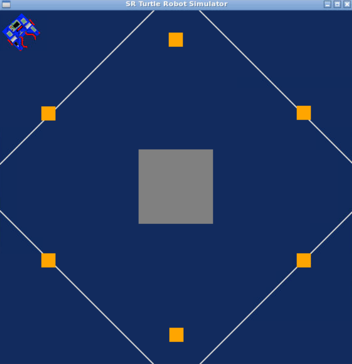
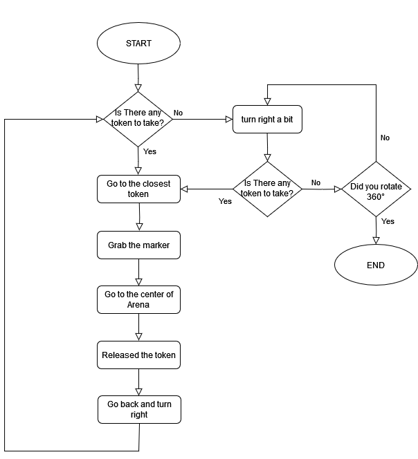
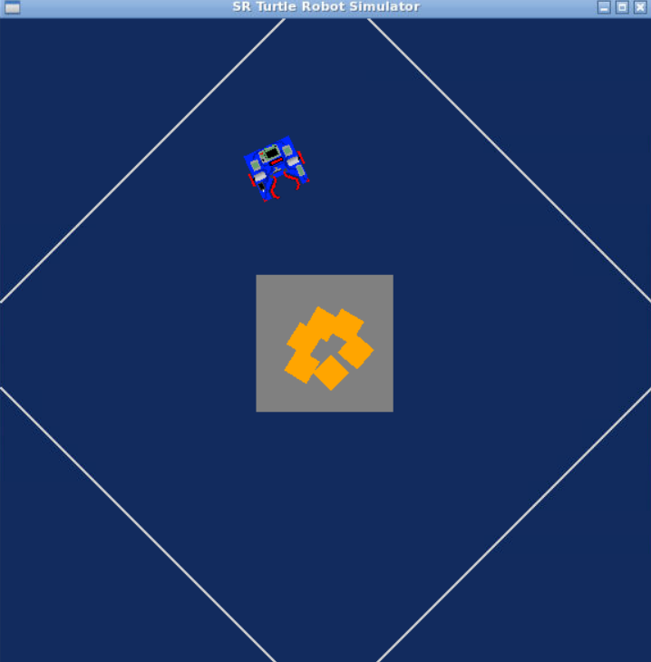

Python Robotics Simulator
================================

This is a simple, portable robot simulator developed by [Student Robotics](https://studentrobotics.org).
Some of the arenas and the exercises have been modified for the Research Track I course

Installing and running
----------------------

The simulator requires a Python 2.7 installation, the [pygame](http://pygame.org/) library, [PyPyBox2D](https://pypi.python.org/pypi/pypybox2d/2.1-r331), and [PyYAML](https://pypi.python.org/pypi/PyYAML/).

Pygame, unfortunately, can be tricky (though [not impossible](http://askubuntu.com/q/312767)) to install in virtual environments. If you are using `pip`, you might try `pip install hg+https://bitbucket.org/pygame/pygame`, or you could use your operating system's package manager. Windows users could use [Portable Python](http://portablepython.com/). PyPyBox2D and PyYAML are more forgiving, and should install just fine using `pip` or `easy_install`.

## Troubleshooting

When running `python run.py <file>`, you may be presented with an error: `ImportError: No module named 'robot'`. This may be due to a conflict between sr.tools and sr.robot. To resolve, symlink simulator/sr/robot to the location of sr.tools.

On Ubuntu, this can be accomplished by:
* Find the location of srtools: `pip show sr.tools`
* Get the location. In my case this was `/usr/local/lib/python2.7/dist-packages`
* Create symlink: `ln -s path/to/simulator/sr/robot /usr/local/lib/python2.7/dist-packages/sr/`


Robot API
---------

The API for controlling a simulated robot is designed to be as similar as possible to the [SR API][sr-api].

### Motors ###

The simulated robot has two motors configured for skid steering, connected to a two-output [Motor Board](https://studentrobotics.org/docs/kit/motor_board). The left motor is connected to output `0` and the right motor to output `1`.

The Motor Board API is identical to [that of the SR API](https://studentrobotics.org/docs/programming/sr/motors/), except that motor boards cannot be addressed by serial number. So, to turn on the spot at one quarter of full power, one might write the following:

```python
R.motors[0].m0.power = 25
R.motors[0].m1.power = -25
```

### The Grabber ###

The robot is equipped with a grabber, capable of picking up a token which is in front of the robot and within 0.4 metres of the robot's centre. To pick up a token, call the `R.grab` method:

```python
success = R.grab()
```

The `R.grab` function returns `True` if a token was successfully picked up, or `False` otherwise. If the robot is already holding a token, it will throw an `AlreadyHoldingSomethingException`.

To drop the token, call the `R.release` method.

Cable-tie flails are not implemented.

### Vision ###

To help the robot find tokens and navigate, each token has markers stuck to it, as does each wall. The `R.see` method returns a list of all the markers the robot can see, as `Marker` objects. The robot can only see markers which it is facing towards.

Each `Marker` object has the following attributes:

* `info`: a `MarkerInfo` object describing the marker itself. Has the following attributes:
  * `code`: the numeric code of the marker.
  * `marker_type`: the type of object the marker is attached to (either `MARKER_TOKEN_GOLD`, `MARKER_TOKEN_SILVER` or `MARKER_ARENA`).
  * `offset`: offset of the numeric code of the marker from the lowest numbered marker of its type. For example, token number 3 has the code 43, but offset 3.
  * `size`: the size that the marker would be in the real game, for compatibility with the SR API.
* `centre`: the location of the marker in polar coordinates, as a `PolarCoord` object. Has the following attributes:
  * `length`: the distance from the centre of the robot to the object (in metres).
  * `rot_y`: rotation about the Y axis in degrees.
* `dist`: an alias for `centre.length`
* `res`: the value of the `res` parameter of `R.see`, for compatibility with the SR API.
* `rot_y`: an alias for `centre.rot_y`
* `timestamp`: the time at which the marker was seen (when `R.see` was called).

For example, the following code lists all of the markers the robot can see:

```python
markers = R.see()
print "I can see", len(markers), "markers:"

for m in markers:
    if m.info.marker_type in (MARKER_TOKEN_GOLD, MARKER_TOKEN_SILVER):
        print " - Token {0} is {1} metres away".format( m.info.offset, m.dist )
    elif m.info.marker_type == MARKER_ARENA:
        print " - Arena marker {0} is {1} metres away".format( m.info.offset, m.dist )
```

[sr-api]: https://studentrobotics.org/docs/programming/sr/


# RT1, Assignment 1
First assignment of Research Track 1 course at UniGe Robotics Engineering.

## Introduction
This python script makes a simulated robot move to bring all the boxes called `token` in an arena. The robot grabs them, transports them to the center of the arena, and releases them. The process continues until all tokens have been moved.





### Installing and Running

1. Clone the repository to your local machine (or download):
```bash
git clone https://your-repository-link-here
```

2. Execute the program with:
```bash
$ python run.py assignment.py
```


## FlowChart




## Function Descriptions

Detailed descriptions of the functions within the robot control script are as follows:

### `drive(speed, seconds)`
Controls the robot's forward and backward movements by setting a consistent speed for both motors.

- **Parameters**:
  - `speed` (int): The power level sent to the motors to determine the robot's speed. Positive values move the robot forward, negative values move it backward.
  - `seconds` (int): The time in seconds for which the robot continues moving at the set speed.

 
### `turn(speed, seconds)`
Controls the robot's right and left rotations by running motors in opposite directions.

- **Parameters**:
  - `speed` (int): The power level for the rotation. Positive values turn the robot to the right, and negative values to the left.
  - `seconds` (int): The duration of the turn.


### `find_token(idMarkers)`
Identifies the closest token that is not included in the passed list of IDs, ignoring already those tokens.

- **Parameters**:
  - `idMarkers` (list of int): list of code of tokens to not consider.
- **Returns**: 
  - code (int): code of the closest token (-1 if no token out of list is detected)
	 - dist (float): distance of the closest token (-1 if no token out of list is detected)
	 - rot_y (float): angle between the robot and the token (-1 if no token out of list is detected)
  

### `isThereToken(idMarkers)`
Checks the presence of any unprocessed tokens within the robot's field of vision.

- **Parameters**:
  - `idMarkers` (list of int): list of code of tokens to not consider.
- **Returns**: A boolean value, `True` if there are tokens to be processed, `False` otherwise.

### `lookForToken(idMarkers)`
Executes a rotational search any tokens not in the specified list if none are initially visible.

- **Parameters**:
  - `idMarkers` (list of int): IDs of markers to ignore.
- **Returns**: `True` if a token is eventually found before or during the rotation, `False` if no new tokens are detected after a complete 360-degree turn.

### `seeCenterArena()`
Calculates how the robot should move relative to the arena's center by determining the distance and angle from the robot's current position.

- **Returns**: The distance (`dist`) to the center of the Arena and the angle (`rot_y`) between the robot and the center of the Arena.

### `driveToArena()`
Navigates the robot towards the center of the Arena, continuously adjusting its path until it is within a defined proximity threshold.

- **Behavior**: Calls `seeCenterArena()` to obtain navigation parameters and commands the robot to adjust its trajectory until the target position is reached.

### `driveTo(dist, angle)`
Directs the robot to a specific point by controlling the linear and angular movements to meet the target distance and orientation, moving just a little bit.

- **Parameters**:
  - `dist` (float): The distance to the target point from the robot.
  - `angle` (float): The orientation angle to the target point from the robot's current heading.
- **Behavior**: The robot moves and turns accordingly to reach the precise location, defined by the distance and angle parameters.

### `main()`
Serves as the entry point for the robot control program, orchestrating the token manipulation process through sequential function calls.

- **Behavior**: Maintains a list of processed token IDs, searches for new tokens, approaches and grabs them, navigates back to the arena's center to release them, and repeats this process until all tokens are processed.
- **Output**: Console messages indicating progress, such as token capture and release events, and a final report on the number of tokens moved.

This comprehensive function documentation should enable any developer or user to grasp the intricacies of the robot's operational procedures and the purpose behind each segment of code.



